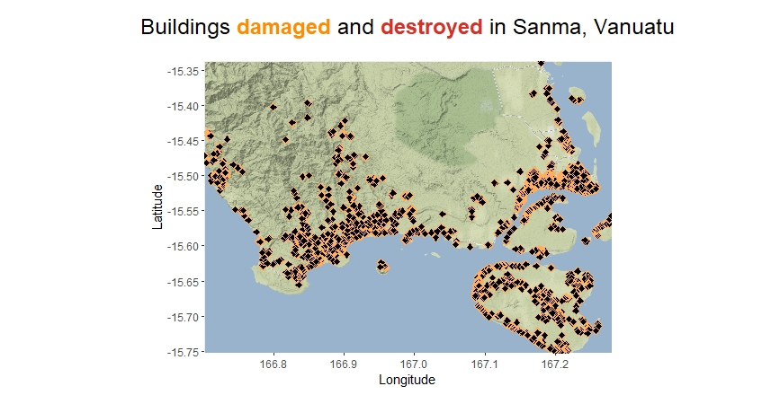
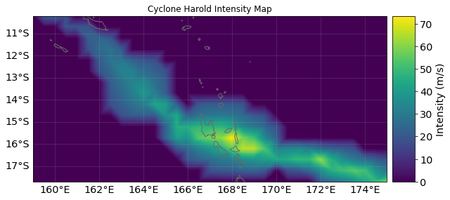

# MSc Dissertation
This is a repository which contains some of the main files written during my MSc Dissertation, 'Benchmarking predictions of post-disaster human displacement'.

## ODDRIN R Files
Please note that some of the code presented here depends on the installation of ODDRIN, the downloading and storing of relevant data, and some packages and functions in the ODDRIN files. These functions are mostly not included in the files given here unless absolutely necessary, with the aim of distinguishing between code written during this dissertation and that which was already created. The ODDRIN repository, which contains installation instructions and some files which are referenced below, [can be found here.]

Roughly speaking, the first four files below (ODDpolys, Data_viz, Init, and OldOSM) are new, while the last two files (DispX_new and Model_changes) are new versions of previously created files which have been developed during this dissertation. Some of the new files contain functions which build off previous versions of functions, and we do our best to note whenever this is the case below. 

##### ODDpolys.R

Key Functions:
- `convIso3Country` - function was already built in ODDRIN which converts a country's ISO3 code to the country name
- `cleanValData` - filters to the inputted country iso3 code, removes NA columns, orders the rows such that highest admin levels are at the  bottom, formats the date columns, adds a column describing the polygon which will be used in getPolys to extract data from OSM
- `getPolys` - extracts polygons from OSM given the validation data spreadsheet
- `extractIndices` - extracts the indices of the rows of the coordinates in the ODDpixels object that have points contained within the polygons that were extracted from getPolys.
- `initialize ODDpolys` - fill the slots of ODDpolys with polyIndices (a list of vectors, one for each polygon, with each vector containing the indices of the ODDpixels object whose points lie within the polygon), sourceInfo (data frame made up of source date, source type, and the source itself), valDF (dataframe with the validation data, i.e. mortality, displacement, buildings damaged, buildings destroyed)
- `inPoly`: function which was already built in ODDRIN which allows the extraction of point indices within a grid
- `ExtractOSMBuild` - function which was already built in ODDRIN which allows extraction of OSM buildings for a given bbox
- `ParAggnBuildings` - function which was already built in ODDRIN which allows the aggregation of points to pixels

##### Data_viz.R

##### Init.R

##### OldOSM.R

##### DispX_new.R

##### Run_algo.R

##### Model_changes.R

## CLIMADA Python Files

Similar to the above, running this CLIMADA file will require the installation of both Python and CLIMADA's software, instructions for which [are available here.]

## Data

The Cyclone Harold data can be found in tc_harold_val_data.csv. Other relevant data can be found on the ODDRIN repository, as well as through citations in Section 2.2 of the dissertation.

## Comments
Some of the code and functions can take several days or even weeks to run, depending on parameter choices. When this is the case, we have tried to explicitly warn the user and comment out very intense computations. The full ODDpolys and BD objects which are used in calculations are provided, to save the user time in initialising these. The ODDpixels object was too large to store here. I am happy to email this object as an RDS file upon request; my email address is james-obrien1@outlook.com.

[can be found here.]: https://github.com/hamishwp/ODDRIN

[are available here.]: https://climada-python.readthedocs.io/en/v3.2.0/guide/Guide_Installation.html
