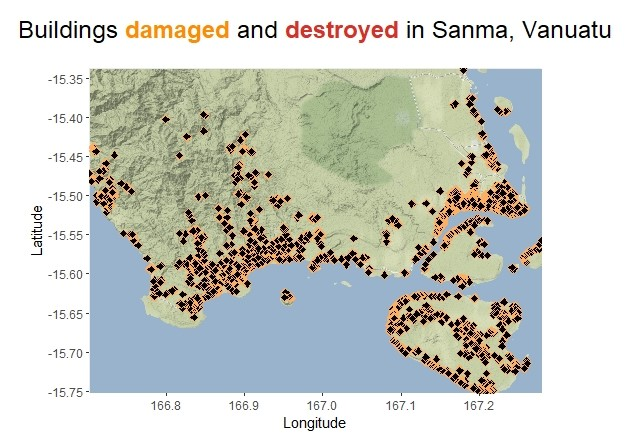

# MSc Dissertation
This is a repository which contains some of the main files written during my MSc Dissertation, 'Benchmarking predictions of post-disaster human displacement'.

## ODDRIN R Files
Please note that some of the code presented here depends on the installation of ODDRIN, the downloading and storing of relevant data, and some packages and functions in the ODDRIN files. These functions are mostly not included in the files given here unless absolutely necessary, with the aim of distinguishing between code written during this dissertation and that which was already created. The ODDRIN repository, which contains installation instructions and some files which are referenced below, [can be found here.]

Roughly speaking, the first four files below (ODDpolys, Data_viz, Init, and OldOSM) are new, while the last two files (DispX_new and Model_changes) are new versions of previously created files which have been developed during this dissertation. Some of the new files contain functions which build off previous versions of functions, and we do our best to note whenever this is the case below. 

##### ODDpolys.R

##### Data_viz.R

##### Init.R

##### OldOSM.R

##### DispX_new.R

##### Model_changes.R

## CLIMADA Python Files

## Data

## Comments
Some of the code and functions can take several days or even weeks to run, depending on parameter choices. When this is the case, we have tried to explicitly warn the user and comment out very intense computations. The full ODDpolys and BD objects which are used in calculations are provided, to save the user time in initialising these. The ODDpixels object was too large to store here. I am happy to email this object as an RDS file upon request; my email address is james-obrien1@outlook.com.

[can be found here.]: https://github.com/hamishwp/ODDRIN
